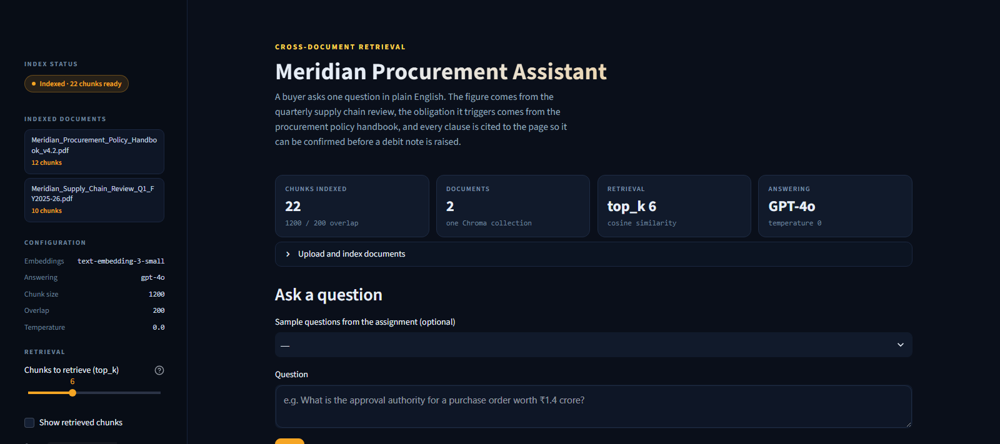
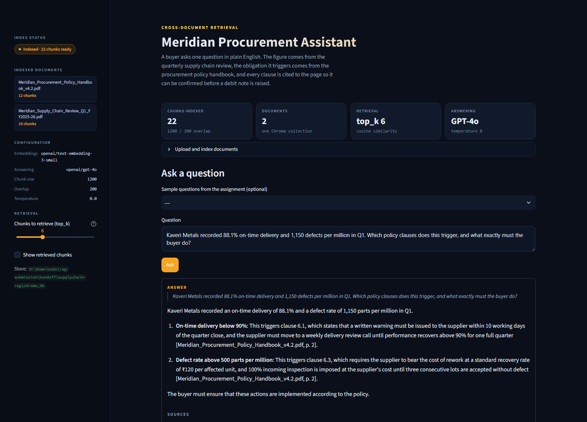
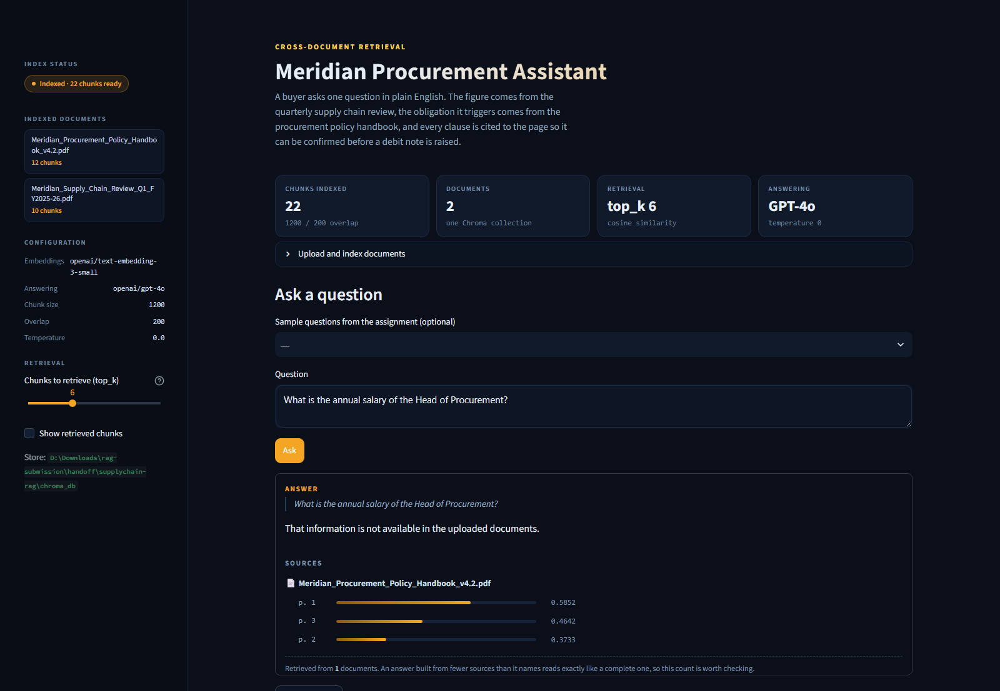
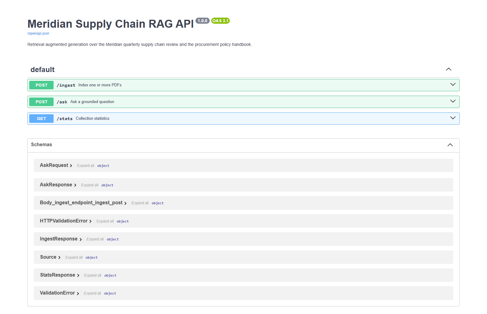

# Meridian Supply Chain RAG Assistant

A retrieval augmented generation system over two internal documents belonging to
Meridian Components Pvt. Ltd., an automotive electronics manufacturer:

| Document | What it holds |
|---|---|
| `Meridian_Supply_Chain_Review_Q1_FY2025-26.pdf` | Supplier scorecards, freight lanes, inventory, line stoppages, quality, risks, committed actions |
| `Meridian_Procurement_Policy_Handbook_v4.2.pdf` | Classification, approval limits, onboarding, scorecard weights, penalty clauses, safety stock, escalation |

A buyer asks one question in plain English. The system finds the relevant
passages in whichever document holds them — often both — and answers with the
document name and page number cited, so the clause can be verified before
anyone acts on it.

---

## Why this problem needs RAG

GPT-4o has never read Meridian's procurement handbook. Asked "what penalty
applies when a supplier delivers late", it will produce a fluent, plausible,
completely invented answer, because every company writes its own rules.

The pipeline fixes that in five steps:

1. **Read** — extract text from each PDF, page by page.
2. **Chunk** — cut it into ~1200-character pieces with recursive character splitting.
3. **Embed** — turn each chunk into a 1536-dimension vector with `text-embedding-3-small`.
4. **Store** — persist those vectors in ChromaDB on disk.
5. **Ask** — embed the question, pull the closest chunks, and hand *only those*
   to GPT-4o along with the question.

The model never sees a document it wasn't given. That is the whole point.

---

## Setup

Requires Python 3.10 or above.

```bash
git clone https://github.com/Harsh1t-S/supplychain-rag
cd supplychain-rag

python -m venv .venv
source .venv/bin/activate          # Windows: .venv\Scripts\activate

pip install -r requirements.txt

cp .env.example .env               # then open .env and paste your key
```

`.env` must contain:

```
OPENAI_API_KEY=sk-...
```

`.env` is listed in `.gitignore` and is never committed. A key pushed to a
public repository is detected and disabled within minutes.

### Index the documents

```bash
python ingest.py
```

Expected output:

```
Indexing 2 file(s) from data/ ...
  Meridian_Procurement_Policy_Handbook_v4.2.pdf: 3 pages -> 12 chunks
  Meridian_Supply_Chain_Review_Q1_FY2025-26.pdf: 3 pages -> 10 chunks

2 files processed, 22 chunks stored.
Collection now holds 22 chunks total.
```

### Run the interface

```bash
streamlit run app.py
```

Opens at `http://localhost:8501`. You can also upload the PDFs from inside the
app rather than running `ingest.py` — the "Index uploaded files" button does the
same work.

### Run the optional FastAPI backend

```bash
uvicorn api.main:app --reload
```

Then open `http://localhost:8000/docs` and exercise the endpoints from the
automatic documentation page.

| Method | Endpoint | Input | Output |
|---|---|---|---|
| POST | `/ingest` | One or more PDF files | `{"files": 2, "chunks": 22, ...}` |
| POST | `/ask` | `{"question": "...", "top_k": 6}` | `{"answer": "...", "sources": [{"file": "...", "page": 3}]}` |
| GET | `/stats` | — | Collection name, chunk count, embedding model, LLM model |

### Reproduce the test answers

```bash
python run_test_questions.py --show-chunks
```

Writes every answer, its sources, and the chunks that produced it to
`docs/test_answers.md`.

---

## Design decisions

### Chunk size 1200, overlap 200

**One-line reason: both documents are table-dominated, and at 800 characters
the supplier scorecard and the approval-limit table split across chunk
boundaries, so the retriever returns half a table.**

The longer form: the questions that matter here are lookups into tables — the
approval authority for a ₹1.4 crore purchase order is one row of the table in
handbook section 3; the safety stock floor is one row of the table in section 8.
A chunk containing rows 1–3 of a five-row table is actively misleading, because
the model answers confidently from the rows it can see. 1200 characters is the
top of the range the brief permits and keeps each of these tables intact. The
200-character overlap means a heading like "6.3 Defect rate above 500 parts per
million" stays attached to the clause text that follows it even when a split
lands nearby.

Measured result: 22 chunks from 6 pages, largest 1198 characters, no table in
either document split across a boundary.

### top_k = 6

Questions 5 to 9 need a *number* from the quarterly review and a *rule* from the
policy handbook in the same context window. With `top_k=3`, all three chunks
routinely come from whichever document is the stronger semantic match — ask
about Kaveri Metals' defect rate and you get three chunks of scorecard and no
penalty clause, so the model has the number but not the consequence. 6 is the
smallest value that reliably pulls from both documents. The slider in the
sidebar lets you watch this failure happen at 3 and resolve at 6.

### Page-level chunking

Each page is split independently rather than concatenating the document first.
If a chunk straddled a page boundary there would be no honest page number to
cite, and the citation is the entire point for a buyer who has to open the
handbook and confirm the clause.

### Deterministic chunk IDs

Chunk IDs are a SHA-256 of `filename | page | text`. Re-indexing an unchanged
file upserts over the same rows instead of appending duplicates. Without this,
pressing "Index" twice doubles every chunk, which quietly degrades retrieval
because near-identical neighbours crowd out genuinely different content.

### Refusal

The system prompt instructs the model to answer only from the supplied context
and to reply "That information is not available in the uploaded documents."
when it cannot. Temperature is 0. This is what question 10 tests.

---

## Deployment

Not deployed. The assignment asks for a repository and a demo, not a hosted URL,
and a public deployment carrying a live API key can be spent by anyone who finds
it. `deploy/` contains a Render blueprint and a Dockerfile for anyone who wants
to stand one up; note that `chroma_db/` is ephemeral on both Render and
Streamlit Community Cloud, which is why the app has an **Index the files in
data/** button and ships the PDFs in `data/`.

---

## Demo video

The recording itself is not in this repository. What is here is everything
needed to produce it: a narration track built offline with Piper TTS, a timed
cue sheet, and a capture script. The narration is pre-generated so the audio is
clean and the timing is fixed rather than improvised over a live take.

```bash
cd video
python build_narration.py        # regenerates segments/ and narration_full.mp3
```

- `video/narration_full.mp3` — 2:59 continuous narration with gaps for on-screen action
- `video/narration_cuesheet.md` — every cue with its timestamp and what to do on screen
- `video/segments/*.wav` — individual lines, if you prefer to place them on a timeline
- `video/record_demo.sh` — capture the screen and mux the narration onto it

```bash
cd video
./record_demo.sh record     # 180s screen capture
./record_demo.sh mux        # lay narration over it -> demo_final.mp4
./record_demo.sh check      # verify duration and streams
```

Play `narration_full.mp3` in one ear while recording and follow the cue sheet.
**Before recording, confirm no API key is visible in any terminal or editor pane.**

---

## The prompt

The full system prompt sent with every question, from [`rag.py`](rag.py). Rule 1
is what the trap question tests, rule 2 is what forces a cross-document answer to
show both halves of its working, and rule 5 exists because the source documents
contradict each other in one place (see the honest notes below).

```text
You are a procurement assistant for Meridian Components Pvt. Ltd.

Answer ONLY from the context provided below. The context is extracted from the
company's own supply chain review and procurement policy handbook.

Rules:
1. If the context does not contain the answer, reply exactly: "That information
   is not available in the uploaded documents." Do not guess, do not use general
   knowledge, and do not reason from what is typical at other companies.
2. When the answer combines a figure from the performance review with a rule
   from the policy handbook, state both explicitly and name the clause number.
3. Cite the document name and page number inline for each fact you assert,
   in the form [Document name, p. N].
4. Quote exact figures, percentages, clause numbers and dates as they appear.
   Never round or approximate a number that is stated precisely.
5. If the context contains figures that contradict each other, say so rather
   than silently picking one.
6. Be direct. A buyer is going to act on this answer.
```

The user turn carries the retrieved chunks, each labelled with its source file
and page, followed by the question. Temperature is 0.

---

## Screenshots

| | |
|---|---|
|  | **Indexed and persisted** — both PDFs in one collection, 22 chunks, with the models and chunk settings shown in the sidebar. |
|  | **A cross-document answer** — the Kaveri Metals question, correctly triggering clauses 6.1 and 6.3, with sources cited from *both* the review and the handbook. |
|  | **The trap question refused** — neither document contains salary data, and the app says so rather than inventing a number. |
|  | **FastAPI `/docs`** — all three endpoints live: `POST /ingest`, `POST /ask`, `GET /stats`. |

---

## Test questions and answers

**[`docs/test_answers.md`](docs/test_answers.md) contains the answers this app
actually produced** for all ten questions, generated by
`python run_test_questions.py --show-chunks`. For each question it records the
answer, every source document and page with its similarity score, the raw
retrieved chunks, and — for the five cross-document questions — whether
retrieval reached both PDFs or only one. **All five reached both.**

The table below is the **hand-verified answer key**, read directly out of the two
PDFs, against which those answers were checked.

Verifying by hand rather than trusting a confident-sounding output is the
difference between an answer and a correct answer.

### Q1 — Highest spend supplier and its on-time delivery
**Shenzhen Rui Electronics**, ₹21.9 crore Q1 spend, **79.5%** on-time delivery.
It is simultaneously the highest-spend and worst-delivering supplier.
*Source: review p.1, section 2.*

### Q2 — Line stoppages
**Seven events**, **41 hours** of downtime, estimated **₹1.9 crore** in lost
output. Four traced to microcontroller supply from Shenzhen Rui, two to PCB
quality from Trident Circuit Boards, one to a transporter strike on the
Coimbatore–Pune corridor (outside supplier control).
*Source: review p.1 section 1, p.2 section 5.*

> ⚠️ Note the document contradicts itself here — see "Honest notes" below.

### Q3 — Approval authority for a ₹1.4 crore purchase order
**Chief Operating Officer.** The band "above ₹1 crore and up to ₹5 crore" is COO;
₹1.4 crore falls inside it.
*Source: handbook p.1, section 3.*

### Q4 — Supplier classification categories
**Critical, Strategic, Standard, Tail.** A supplier is **Critical** if *any one*
of these holds: single-source for any part; annual spend above ₹10 crore;
supplies a safety-related component. A supplier meeting more than one class is
assigned to the higher class.
*Source: handbook p.1, section 2.*

### Q5 — Kaveri Metals: 88.1% OTD, 1,150 PPM *(cross-document)*
Two clauses fire:

- **Clause 6.1** (on-time delivery below 90% in any quarter) — written warning
  within 10 working days of quarter close, and the supplier moves to a **weekly
  delivery review call** until performance recovers above 90% for one full quarter.
- **Clause 6.3** (defect rate above 500 PPM) — the supplier bears rework at the
  standard recovery rate of **₹120 per affected unit**, and **100% incoming
  inspection at the supplier's cost** until three consecutive lots are accepted
  without defect.

**Clause 6.2 does not fire** — that needs OTD below 85% for two consecutive
quarters, and Kaveri is at 88.1%. Separately, under section 5, delivering below
90% bars Kaveri from rating band A regardless of its total score.
*Sources: review p.1 (figures), handbook p.2 (clauses 6.1, 6.3), handbook p.2 (section 5 band rule).*

### Q6 — Single-source microcontrollers *(cross-document)*
Shenzhen Rui Electronics is **Critical** on two independent grounds: it is
single-source, and its ₹21.9 crore spend exceeds ₹10 crore.

**Policy requires** (clause 7.1) a qualified second source **within 12 months**
of the Critical classification being assigned, with progress reported monthly to
the Management Committee. Once dual sourcing exists, clause 7.2 caps any single
supplier at 60% of the volume of any one part.

**The company is already:** qualifying Anh Long Semiconductors (Hai Phong,
Vietnam) as second source, target 30 Sep 2025 (Action 1); shifting 30% of
Shenzhen volume to planned air freight until dual sourcing is live, target
15 Aug 2025 (Action 2); and applying for a customs classification ruling on the
microcontroller HS code, target 12 Sep 2025 (Action 7).

Worth flagging: Vietnam appears to be a new supply country, which under clause
7.3 requires Chief Operating Officer approval supported by a written logistics,
customs and currency assessment.
*Sources: review p.1 & p.3 (sections 2, 8, 9), handbook p.2 (section 7).*

### Q7 — Safety stock for microcontrollers *(cross-document)*
**30 days.**

Calculation: 46-day lead time × 0.25 = **11.5 days**.
Floor: the part is *imported* and supplied by a *Critical* supplier → **30 days**.
The policy states the higher value applies, so the 30-day floor governs, not the
11.5-day calculation.
*Sources: review p.1 (46-day lead time), handbook p.3 (section 8).*

### Q8 — Trident Circuit Boards at 640 PPM *(cross-document)*
640 PPM exceeds the 500 PPM threshold, so **clause 6.3** applies: Trident bears
the **cost of rework at ₹120 per affected unit**, and **100% incoming inspection
is imposed at Trident's cost** until three consecutive lots are accepted without
defect. The review confirms 100% inspection is already in force.

Trident is also at 84.6% OTD, below 90%, so **clause 6.1** applies as well; and
its corrective action report arrived 11 days late against the 10-working-day
requirement in the responsiveness dimension of the scorecard.
*Sources: review p.1 & p.2 (sections 2, 6), handbook p.2 (clause 6.3, section 5).*

### Q9 — Suppliers below band B on on-time delivery alone *(cross-document)*
This one has a trap inside it. Section 5 states that on the OTD dimension taken
alone, a supplier below **90%** cannot score band A, and a supplier below **75%**
cannot score band B.

**No supplier falls below 75%.** The worst is Shenzhen Rui at 79.5%. So strictly
on OTD alone, none of them drop below band B — though Shenzhen Rui (79.5%),
Trident (84.6%) and Kaveri (88.1%) are all barred from band A.

The consequential finding is Shenzhen Rui: 83.2% in Q4 FY2024-25 and 79.5% in
Q1, i.e. **below 85% for two consecutive quarters**, which fires **clause 6.2** —
a debit note of **2% of quarterly invoice value** (≈ ₹43.8 lakh on ₹21.9 crore)
plus a formal improvement plan within 15 working days; failure to submit
escalates to clause 6.4 and business hold.

**Escalation path** (section 10): level 3 Head of Procurement, 72-hour response,
for risk of line stoppage within 7 days; level 4 Chief Operating Officer,
5 working days, for an actual line stoppage. Shenzhen Rui caused four actual
stoppages, so level 4 applies.
*Sources: review p.1 (scorecard, prior-quarter figure), handbook p.2 (section 5, clauses 6.2, 6.4), handbook p.3 (section 10).*

### Q10 — Trap question
"What is the annual salary of the Head of Procurement?"

Neither document contains any salary information. The app must reply that the
information is not available in the uploaded documents. **It must not invent a
figure.**

---

## Honest notes — what did not work well

**The source document contradicts itself, and the app faithfully reproduces the
contradiction.** Review section 5 states "Four of the seven events (22 hours of
the 41) trace back to microcontroller supply". But the per-event table lists
those four events at 4 + 11 + 6 + 4 = **25 hours**, not 22. The individual
durations do sum correctly to 41 across all seven events, so the error is in the
22 figure. Depending on which chunk is retrieved, the app answers 22 or 25. This
is not a retrieval bug — it is the document being wrong, and it is exactly why
citing a page number matters. The system prompt instructs the model to flag
contradictory figures rather than silently picking one.

**Question 9 is ambiguous and the app's answer depends on how you read it.**
"Fall below the B rating band on on-time delivery alone" can mean (a) below the
75% floor that bars band B, in which case the answer is *nobody*, or (b) failing
to reach band A standard, in which case it is three suppliers. The app tends
toward reading (b) unless the question is phrased tightly. Retrieval is correct
in both cases; the ambiguity is in the question, not the system.

**Table structure is lost on extraction.** `pypdf` returns the supplier
scorecard as run-together text with the column alignment gone. It remains
readable enough for GPT-4o to parse row by row, and the 1200-character chunk
size keeps each table whole, but a question asking to compare two specific cells
across distant columns is noticeably weaker than one asking for a single row.
`pdfplumber` table extraction would improve this; the brief asks to keep the
system simple, so it was left out.

**At `top_k=3` most cross-document questions fail.** This was the single biggest
issue during development. The symptom looks like bad reasoning — the model
answers the "number" half of the question and ignores the "rule" half — but
printing the retrieved chunks shows all three came from the same PDF. Checking
retrieval before blaming the model saved considerable time.

**Only 22 chunks total.** The two PDFs are 3 pages each. With so small a corpus,
`top_k=6` retrieves over a quarter of the entire collection, so retrieval quality
matters less than it would at scale. On a realistic corpus of hundreds of
documents this configuration would need re-tuning.

---

## Repository structure

```
supplychain-rag/
├── app.py                    # Streamlit interface
├── ingest.py                 # load, chunk, embed, store in Chroma
├── rag.py                    # retrieve + prompt + call GPT-4o
├── config.py                 # all tunables in one place
├── run_test_questions.py     # runs the 10 assignment questions
├── api/
│   └── main.py               # optional FastAPI backend
├── data/                     # the two provided PDFs
├── chroma_db/                # persisted vector store (gitignored)
├── docs/                     # generated test answers (see docs/README.md)
├── deploy/                   # Render blueprint, Dockerfile, hosting notes
├── video/                    # Piper TTS narration + recording helper
├── .streamlit/config.toml    # dark theme, headless server
├── requirements.txt
├── .env.example
├── .gitignore
└── README.md
```

## Stack

| Component | Choice |
|---|---|
| Language | Python 3.10+ |
| PDF reading | `pypdf` |
| Chunking | `RecursiveCharacterTextSplitter`, 1200 / 200 |
| Embeddings | OpenAI `text-embedding-3-small` |
| Vector store | ChromaDB, persisted to `chroma_db/` |
| Answering model | GPT-4o, temperature 0 |
| Orchestration | Plain `openai` SDK |
| Interface | Streamlit |
| Backend (bonus) | FastAPI + Uvicorn |
| Secrets | `.env` via `python-dotenv`, gitignored |
